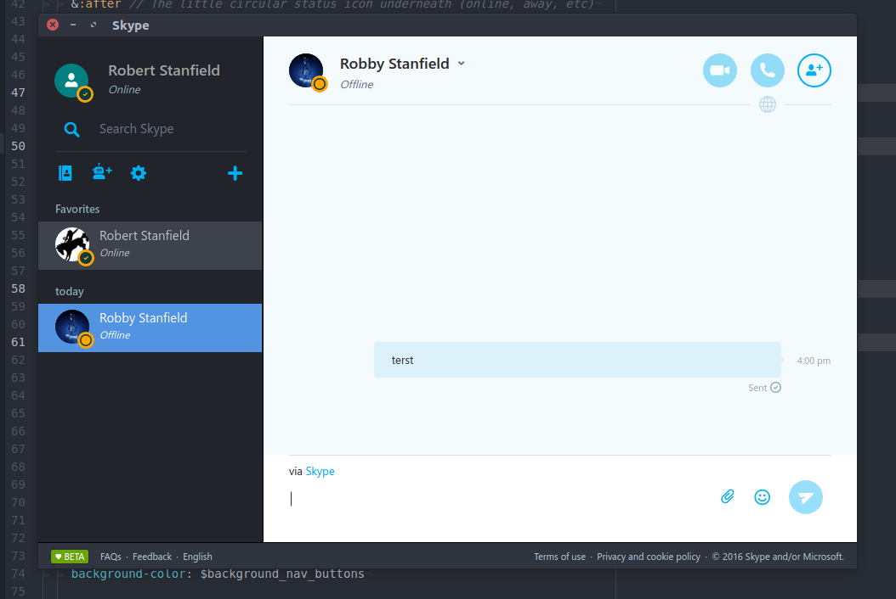

# Ghetto Skype

Ghetto Skype is an electron client that uses Web Skype to better integrate with desktop environments found on Linux.

Credit to [skype-unofficial-client](https://github.com/haskellcamargo/skype-unofficial-client) for coming up with this idea. His version uses node webkit whereas mine uses Electron. This means you get a few extra goodies like notifications from Electron.



## Why it's better than Web Skype
- Spell Check
- Tray Icon shows how many messages are unread (if your desktop environment supports)
- Electron will send notifications to libnotify
- Use your default image viewer (writes to /tmp)
- Start minimized when you start your computer
- Run Skype through a proxy
- Alternative themes

### Cons
- Doesn't support video calls

## Installing

You can download the RPM or DEB package on the [releases page](https://github.com/stanfieldr/ghetto-skype/releases)
or you can build from source with the instructions below.

If you run Arch Linux, you can use the [AUR package](https://aur.archlinux.org/packages/ghetto-skype) [nlowe](https://github.com/nlowe)
created. Please send any issues with the AUR package to [his repository](https://github.com/nlowe/aur-ghetto-skype/issues).

#### Dependencies

If building from source:
- Node 6.3.1 or higher (Debian/Ubuntu/Mint users need nodejs-legacy package)
- Debian based distros need the following packages: `sudo apt-get install build-essential icnsutils graphicsmagick xz-utils libxkbfile-dev libx11-dev libcairo2-dev libjpeg-dev libgif-dev libpango1.0-dev librsvg2-dev`
- If you're creating deb package: `sudo apt-get install fakeroot dpkg`
- Fedora users need the following packages: `sudo dnf install gcc{,-c++} libicns-utils GraphicsMagick libX11-devel libxkbfile-devel libjpeg-turbo-devel cairo-devel giflib-devel pango-devel`
- If you're creating rpm package: `sudo dnf install rpm-build`

#### Try it out

Skip packaging and run this:
```bash
[u@h ghetto-skype]$ npm install && npm start
```

#### Install from source via package manager

We use [electron-builder](https://github.com/electron-userland/electron-builder) to package Ghetto Skype. Change the target to the
format you prefer. By default, it uses "deb". For a full list of supported formats,
refer to the [wiki](https://www.electron.build/configuration/linux) for electron-builder.
The target should be set in `ghetto-skype/package.json`

```bash
[u@h ghetto-skype]$ npm install
[u@h ghetto-skype]$ npm run dist
[u@h ghetto-skype]$ cd dist && ls # package placed here
```

## Tips

There's a separate settings window located in the context menu of the tray icon.

## Using a Proxy

There currently isn't a way to edit this with the settings window right now. You can open `~/.config/Ghetto\ Skype/settings.json` with your favorite text editor and add your proxy to the ProxyRule setting, save, and restart
Ghetto Skype. For a better understanding of the format please refer to Electron's [wiki](https://github.com/electron/electron/blob/master/docs/api/session.md#instance-methods) (specifically ses.setProxy)

Example:
```bash
{
	"StartMinimized": false,
	"MicrosoftAccount": false,
	"NativeImageViewer": false,
	"ProxyRules": "socks5://46.105.6.191:5050"
}
```

## Setting Zoom Level

If the font/photos are not big enough for you, you can use the zoom factor in the `~/.config/Ghetto\ Skype/settings.json`.
This will be added to the settings screen soon.

Example 150%:
```bash
{
	"StartMinimized": false,
	"MicrosoftAccount": false,
	"NativeImageViewer": false,
	"ProxyRules": "socks5://46.105.6.191:5050",
	"ZoomFactor": 1.5
}
```

## Disclaimer
The Skype name, associated trade marks and logos and the "S" logo are trade marks of Skype or related entities. This project is merely a browser :)
