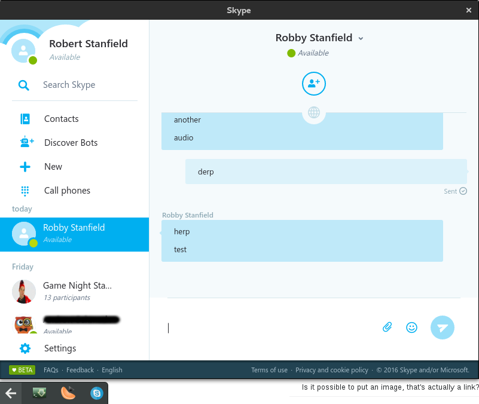

# ghetto-skype
Web Skype + Tray Icon + notify-send

## Installing

```bash
npm install
npm start
```



## Finished
- Tray Icon knows if we have notifications (changes to red)
- Electron works with Web Skypes notification system for messages

## TODO
- Need to figure out how to auto sign in

### Disclaimer
The Skype name, associated trade marks and logos and the "S" logo are trade marks of Skype or related entities.
