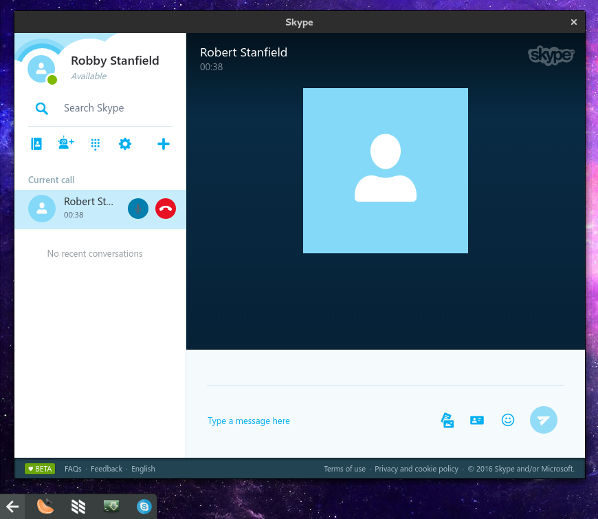

# Ghetto Skype
Are you tired of a buggy 32 bit official Skype client? Then Ghetto Skype is for you!

Credit to [skype-unofficial-client](https://github.com/haskellcamargo/skype-unofficial-client) for coming up with the idea of putting web skype in a Window. It was almost there, but I wanted a tray icon and notifications. This was a great excuse to learn how Electron apps work :)



## Features
- Tray Icon turns red if you have unread messages
- Native notifications from Web Skype via Electron
- Auto login through Microsoft Account

## Installing

First please make sure you have node and npm installed.

Ubuntu users (only older than 16.04) need to install this package to see the tray icon:
```bash
sudo apt-get install libappindicator1
```

Regardless of distro:

```bash

# master should contain stable code, the default branch develop may contain bugs
git clone -b master https://github.com/stanfieldr/ghetto-skype.git
cd ghetto-skype

# By default, the installation directory is `/opt/ghetto-skype`.
# Change this in Makefile if you want to store it elsewhere
sudo make install

# to uninstall
# sudo make uninstall
```

You may delete this folder after you run `make install`, you can run `make uninstall` from the installation directory after you trash this one.

If you need to update, it is recommended to `git pull` in the installation directory. This way you keep your settings file and are alerted of any conflicts if settings have changed.

Here are a few options that can be set in `settings.json`:

- StartMinimized - When skype is launched, it's hidden in the tray till you click it
- MicrosoftAccount - Skips the Skype Login and either logs you in or goes directly to Microsoft's login form.

Remember, edit the settings in the installation directory, not the folder you downloaded ;)

## Disclaimer
The Skype name, associated trade marks and logos and the "S" logo are trade marks of Skype or related entities.
